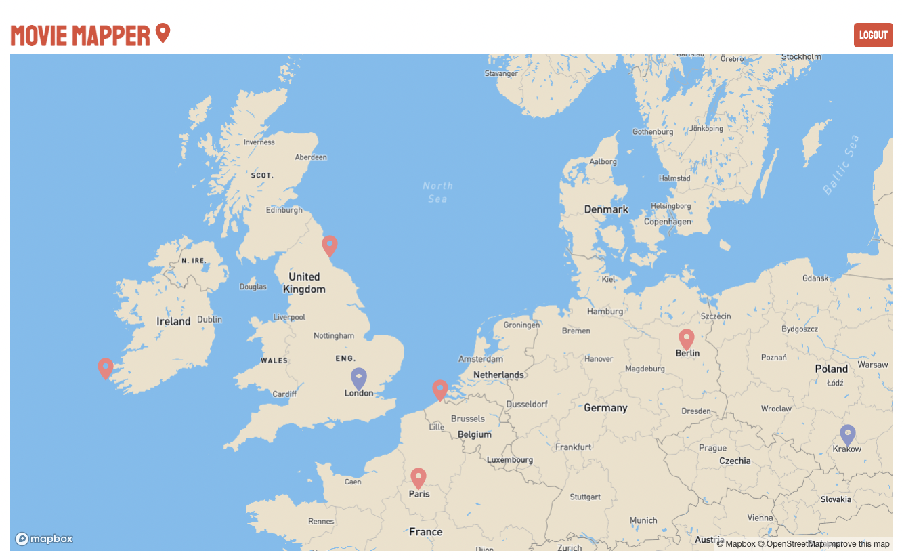

# Movie Mapper



This web app offers an interactive map where you can view and drop pins. The pins represent famous movie locations and give information such as:

* Location
* Description
* Rating
* Author
* Timestamp

You can register as a new user and log in to drop new pins, which you can do by double clicking anywhere on the map. You will be able to tell your pins apart from other users by colour.
___

**Getting Started:**

 1. Clone this repo to your local machine
 ```
git clone https://github.com/Daniel-Slattery/moviemapper.git
```
 2. Navigate to both the 'client' and 'server' folders and install all the required dependecies.
 ```
cd moviemapper
cd client
npm i
cd ../server
npm i
```
 3. Adjust the necessary env variables to match your system. (This includes giving your Mongo database a name and running it in the terminal)
 4. You will need an API key for MapBox
 5. From inside the 'server' folder run the server.
```
node server.js
```
 6. From inside the 'client' folder run the client.
```
npm start
```
 7. The app should appear in the browser where you can register and login
 8. You should be able to view other users' pins now and double click to add your own

 ___

**Tech Stack**

* MongoDB & Mongoose
* Express
* React
* NodeJS
* Material UI
* Bcrypt
* Mapbox

___

**Developers**

Seb Green - [Github](https://github.com/greenseb) - [LinkedIn](https://www.linkedin.com/in/sebastiangreen13/)

Daniel Slattery - [Github](https://github.com/Daniel-Slattery) - [LinkedIn](https://www.linkedin.com/in/daniel-s-dev/)

Jess Edwards - [Github](https://github.com/jah-edw) - [LinkedIn](https://www.linkedin.com/in/jah-edw/)

Nidal Ellawala - [Github](https://github.com/NidalEllawala) - [LinkedIn](https://www.linkedin.com/in/a-nidal-ellawala/)

Daniel Cassell - [Github](https://github.com/Daniel-CC-97) - [LinkedIn](https://www.linkedin.com/in/danielcassell/)

Marius Obreja - [Github](https://github.com/mariusobreja) - [LinkedIn](https://www.linkedin.com/in/marius-o-b8b76a132/)


